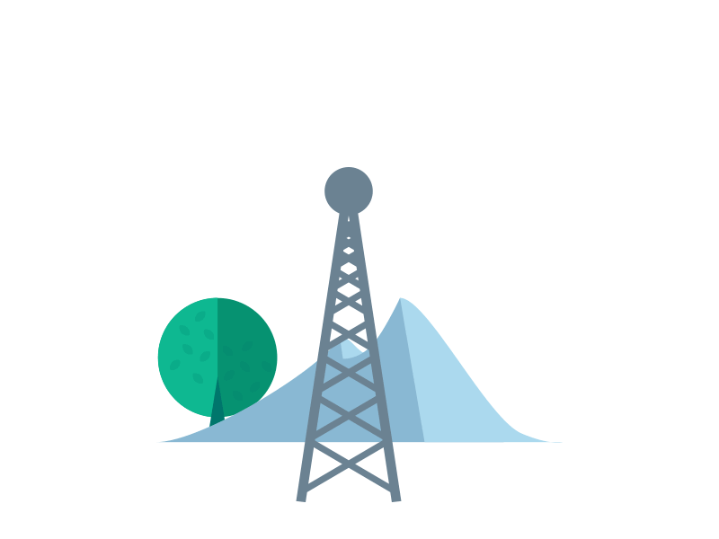

<h1 align="center"> EW course project  </h1>

    
    
    
    
    
    
    
    

<!-- PROJECT LOGO -->
 

  <h3 align="center"> Non-Uniform Antenna Array🎲</h3>
  

  

   A Review article using MATLAB
     
    <a href="https://github.com/RabihND/NonUniformAntennaArray"><strong>Explore the documents »</strong></a>
     
     
  

---

<!-- TABLE OF CONTENTS -->

  
Table of Contents
 
  <ol>
    <li><a href="#about-the-project">About The Project</a></li>
    <li><a href="#parts">Parts</a></li>
    <li><a href="#results">Results</a></li>
    <li><a href="#license">License</a></li>
    <li><a href="#refenences">Refenences</a></li>
    <li><a href="#contact">Contact</a></li>
    <li><a href="#roadmap">Roadmap</a></li>
  </ol>

<!-- ABOUT THE PROJECT -->

## About The Project

  
  

<b>Mastermind</b> is a code-breaking game in which two players compete against each other. The game begins when the first participant, dubbed <b>"The Codemaker"</b>, generates a four-digit (color) code that is hidden. The second participant, dubbed <b>"The Codebreaker"</b> then guesses a code.

The codemaker then evaluates the estimate by handing certain black and white pins to the codebreaker (plus and minus in the paper version). The codebreaker guesses another code based on the evaluation, and the game continues until the codebreaker finds (or fails to locate) the concealed code within the maximum number of <b>tries</b>.

(<a href="#top">back to top</a>)

### Built With

Major frameworks/libraries used in this project:

- [MATLAB 2021b](https://www.mathworks.com/)
- [CVX](http://cvxr.com/cvx/)

(<a href="#top">back to top</a>)

<!-- PARTS -->

## Parts

**1. Master Mind Class**

The main MasterMind game Process; it contains:

- **get_random_solution()**: Returns a random "solution" to be the hidden code.
- **check_guess()**: Returns the nb of "correct" and nb of "misplaced" guess.
- **get_correct_colors()**: Returns the "correct" colors.
- **get_misplaced_colors()**: Returns the "misplaced" colors.
- **is_won()**: Verify that the guess is correct according to the solution.

**2. MainWindowUi Class** (GUI_Window)

The main window of the game designed by Qt; it contains:

- **setupUi()**: The QT codes that generate the main window.
- **resetButtonClicked()**: That delete the selected colors.
- **set_thisguesstable()**: connect the colors.
- **clicked_color()**: Send the selected colors to the Guess table.
- **clicked_submit()**: After clicking the submit button; its check the guess and return the score to the Scores Table.
- **show_game_over()**: Show the Game Over Dialog. -**print_score()**: print score in the terminal (NOT GUI).

**3. GameOverWindow Class** (GUI_Window)

The resulting window, which shows the player's loss(+) or victory(-).

- **display_text()**: Return a text with include the result of the game.(Win/Loss)

**4. Splash Screen Class** (GUI_Windows)

> {⌛}

(<a href="#top">back to top</a>)

<!-- RESULTS -->

## Results

**GUI OUTPUT:**

ScreenShoot Preview 🖼️

  <body>
    
  

  </body>

---

**TERMINAL OUTPUT:**

ScreenShoot Preview 🖼️

  <body>
    
  

  </body>

(<a href="#top">back to top</a>)

<!-- LICENSE -->

## License

Distributed under the MIT License. See `LICENSE.txt` for more information.

(<a href="#top">back to top</a>)

<!-- REFERENCES -->

## Refenences

🔎

(<a href="#top">back to top</a>)

<!-- CONTACT -->

## Contacts

Rabih ND - [@RabihND](https://github.com/RabihND)

**Project Link:** [https://github.com/RabihND/NonUniformAntennaArray](https://github.com/RabihND/NonUniformAntennaArray)

(<a href="#top">back to top</a>)

<!-- ROADMAP -->

## Roadmap

- [x] Write the main code-map.
- [x] Design the GUI window.
- [x] Write the MasterMain Core Functions.
- [x] Design the GameOver window.
- [x] <a href="https://github.com/RabihND/AP2021-2022-Final/releases/latest"><strong>Build the .EXE Release</strong></a>
- [ ] Splash screen
- [ ] Build APK release.

(<a href="#top">back to top</a>)

---

<b>
Amirkabir University  of Technology</b>

(Tehran Polytechnic)

