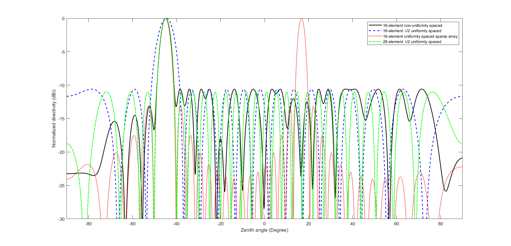

<h1 align="center"> EW course project  </h1>

    
    
    
    
    
    
    
    

<!-- PROJECT LOGO -->
 

  <h3 align="center"> Non-Uniform Antenna Array🎲</h3>
  

  

   A Review article using MATLAB
     
    <a href="https://github.com/RabihND/NonUniformAntennaArray"><strong>Explore the documents »</strong></a>
     
     
  

---

<!-- TABLE OF CONTENTS -->

  
Table of Contents
 
  <ol>
    <li><a href="#about-the-project">About The Project</a></li>
    <li><a href="#parts--results">Parts & Results</a></li>
    <li><a href="#license">License</a></li>
    <li><a href="#refenences">Refenences</a></li>
    <li><a href="#contact">Contact</a></li>
    <li><a href="#roadmap">Roadmap</a></li>
  </ol>

<!-- ABOUT THE PROJECT -->

## About The Project

  
  

<b>Antenna arrays</b> have been employed in wireless communications and radars to synthesize beampatterns with the smallest BW and PSLL achievable. When evaluating the performance of different types of arrays, <b>half-power beamwidth (HPBW)</b> and <b>PSLL</b> are the main metrics to consider. <b>Directivity</b>, or the ratio of energy delivered in the intended direction to total energy communicated, is another key performance characteristic. Traditionally, linear arrays with consistent inter-element spacing have been commonly used. ULAs with uniform excitation-current amplitudes or weights have a short BW but a large PSLL.

We propose a <b>NULA</b> with <b>non-uniform weights</b> in this work. The weights were calculated using a normal window function and the logarithmic function was used for inter-element spacing. A variety of window functions are available in the literature, but only the Bartlett-Hanning window function was employed for this proof of concept.

(<a href="#top">back to top</a>)

### Built With

Major frameworks/libraries used in this project:

- [MATLAB 2021b](https://www.mathworks.com/)
- [CVX](http://cvxr.com/cvx/)

(<a href="#top">back to top</a>)

<!-- PARTS -->

## Parts & Results

**1. INTRODUCTION**
 - What is the array Half Power Beam Width (HPBW)?
 - What is the array Directivity?

**2. MODEL OF THE SYSTEM**

 

<b><i>Fig.1</b> Geometry and notations used for non-uniform linear array.</i>
 

- **Problem1:** 

First, regarding the window that is used for weighting we can see this resulting figure that describes the Beam patterns for various windows for N = 16;

 

- **Problem2:**

Second, to clarify the <b>relationship</b> between <b>HPBW, BW, and directivity</b> as we mentioned before we consider a standard 16-element linear array pointed at the broadside.Fist we find the <b>Dolph-Chebychev weightings</b> for sidelobes of -20dB, -30dB, and -40dB. After that, we plot the resulting beam pattern and we compute the HPBW. BW, and the directivity.

 

- **Problem3:**

By using the technique introduced in the reference <b>“Optimum Array Processing”</b> by <i>Harry L. Van Trees </i>[2]  we design a beam pattern that maximizes the directivity subject to a -35 dB constraint of the sidelobe; considering a standard linear array with 16 elements. After that, we compare the resulting BW with that of a 16 element SLA using DolphChebychev weighting.

 

**3. SUGGESTED METHOD**

The non-uniform distribution of the 16-element linear array was found using a random search approach in the work of an investigator developing a portable radar [5]. <b>MATLAB</b> is used to analyze 100,000 random non-uniform distributions using the convex optimization software <b>CVX </b>[6], which can take more than 3 hours. But in our case, we just want to explain this approach for this we just show how its work.

 

<b>Fig.2</b> <i>Results from code [LA_random_spacing.m]</i>

 

<b>Fig.3</b><i> Distribution of the array elements(related to Fig.2)</i>

(<a href="#top">back to top</a>)

<!-- LICENSE -->

## License

Distributed under the MIT License. See `LICENSE.txt` for more information.

(<a href="#top">back to top</a>)

<!-- REFERENCES -->

## Refenences
🔎

[1] C. A. Balanis, Antenna Theory, and Design. John Wiley&Sons, 1997.

[2] H. L. V. Trees, Optimum Array Processing. Wiley, 2002.

[3] K. L. Bell, H. L . Van Trees, and L. J . Griffiths, Adaptive beampattern control using quadratic constraints for circular array STAP. 8th Annual Workshop on Adaptive Sensor Array Processing ( ASAP 2000), M.I.T. Lincoln Laboratory, Lexington, Massachusetts, pp. 43-48, March 2000.

[4] C. A. Olen and R. T. Compton, Jr. A numerical pattern synthesis algorithm for arrays. IEEE Trans. Antennas Propag., vol.AP-38, pp. 1666- 1676, October 1990.

[5] Z. Peng, P. Nallabolu and C. Li, "Design and Calibration of a Portable 24-GHz 3-D MIMO FMCW Radar with a Non-uniformly Spaced Array and RF Front-End Coexisting on the Same PCB Layer," 2018 IEEE 13th Dallas Circuits and Systems Conference (DCAS), 2018, pp. 1-4, DOI: 10.1109/DCAS.2018.8620117.

[6]M. Grant, and S. Boyd "CVX: Matlab software for disciplined convex programming. http://cvxr.com/cvx

(<a href="#top">back to top</a>)

<!-- CONTACT -->

## Contacts

Rabih ND - [@RabihND](https://github.com/RabihND)

**Project Link:** [https://github.com/RabihND/NonUniformAntennaArray](https://github.com/RabihND/NonUniformAntennaArray)

(<a href="#top">back to top</a>)

<!-- ROADMAP -->

## Roadmap

- [x] Fist Commit
- [ ]

(<a href="#top">back to top</a>)

---

<b>
Amirkabir University  of Technology</b>

(Tehran Polytechnic)

